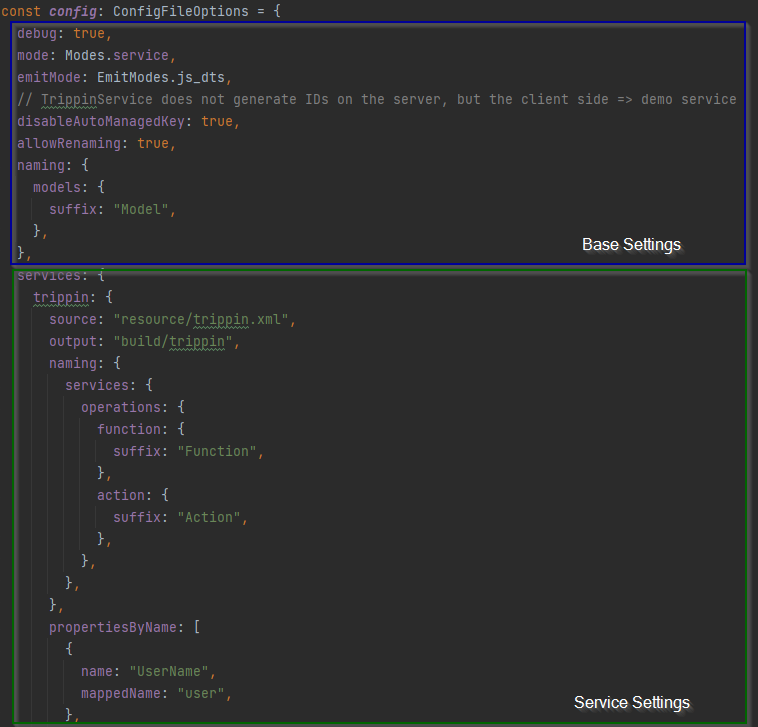

# Configuration

## Basics

### Default Configuration

In the background `odata2ts` has a [defaultConfig](https://github.com/odata2ts/odata2ts/blob/main/packages/odata2ts/src/defaultConfig.ts),
so that you only need to provide those settings which diverge from that.

<p>
  <details>
    <summary>Default Configuration</summary>

```ts
import { ConfigFileOptions, EmitModes, Modes, NamingStrategies } from "@odata2ts/odata2ts";

const defaultConfig = {
  sourceUrlConfig: {},
  refreshFile: false,
  mode: Modes.all,
  emitMode: EmitModes.js_dts,
  debug: false,
  prettier: false,
  tsconfig: "tsconfig.json",
  converters: [],
  skipEditableModels: false,
  skipIdModels: false,
  skipOperations: false,
  skipComments: false,
  enablePrimitivePropertyServices: false,
  disableAutoManagedKey: false,
  allowRenaming: false,
  v2ModelsWithExtraResultsWrapping: false,
  v2EditableModelsWithExtraResultsWrapping: false,
  v4BigNumberAsString: false,
  disableAutomaticNameClashResolution: false,
  bundledFileGeneration: false,
  enumType: "string",
  enableNativeInOperator: false,
  odataVersionV4: "4.0",
  disableBindingProps: false,
  disableDeepInsertProps: false,
  naming: {
    models: {
      namingStrategy: NamingStrategies.PASCAL_CASE,
      propNamingStrategy: NamingStrategies.CAMEL_CASE,
      editableModels: {
        prefix: "Editable",
        suffix: "",
        applyModelNaming: true,
      },
      idModels: {
        prefix: "",
        suffix: "Id",
        applyModelNaming: true,
      },
      operationParamModels: {
        prefix: "",
        suffix: "Params",
        applyModelNaming: true,
      },
      fileName: {
        namingStrategy: NamingStrategies.PASCAL_CASE,
        prefix: "",
        suffix: "Model",
      },
    },
    queryObjects: {
      namingStrategy: NamingStrategies.PASCAL_CASE,
      propNamingStrategy: NamingStrategies.CAMEL_CASE,
      prefix: "Q",
      suffix: "",
      idFunctions: {
        prefix: "",
        suffix: "Id",
      },
      fileName: {
        namingStrategy: NamingStrategies.PASCAL_CASE,
        prefix: "Q",
        suffix: "",
      },
      baseType: {
        applyQNaming: true,
        prefix: "",
        suffix: "BaseType",
      },
    },
    services: {
      prefix: "",
      suffix: "Service",
      namingStrategy: NamingStrategies.PASCAL_CASE,
      main: {
        applyServiceNaming: true,
      },
      collection: {
        prefix: "",
        suffix: "Collection",
        applyServiceNaming: true,
      },
      operations: {
        namingStrategy: NamingStrategies.CAMEL_CASE,
      },
      relatedServiceGetter: {
        namingStrategy: NamingStrategies.CAMEL_CASE,
        prefix: "",
        suffix: "",
      },
      privateProps: {
        namingStrategy: NamingStrategies.CAMEL_CASE,
        prefix: "_",
        suffix: "",
      },
    },
  },
  propertiesByName: [],
  byTypeAndName: [],
}
```

  </details>
</p>

### Configuration Hierarchy

`odata2ts` exposes different configuration possibilities. Here are all of them and the order in which they are applied:

- **default config**: sensible defaults provided by `odata2ts`
- **base settings**: basic settings which apply to all configured services
- **service settings**: settings for one specific service, `source` and `output` must be specified
- **CLI options**: options provided from command line

The base settings are also some kind of default settings as they have an effect on the generation process
of all configured odata services. Base settings are applied on top of the default config.

All settings starting from the `services` attribute are only valid for a specific service and only applied
for its generation run. Service specific settings may override any default or base setting and allow
for reconfiguring entities and properties.

<p>
  <details>
    <summary>Some visual aid: A picture can say more than a thousand words...</summary>



  </details>
</p>

Options specified on the command line always win over other configuration possibilities.
Most base settings are available as CLI options.
Options `source` and `output` are required unless the config file is also used
containing appropriate service definitions.

:::tip

Consider using the config file for all your configurations.

:::

## Base Settings

Here is the list of all **base settings** of the config file. By and large this matches the [CLI options](#cli-options).

| Base Setting                     | Type                         | Default Value     | Description                                                                                                                                                                                     |
| -------------------------------- | ---------------------------- | ----------------- | ----------------------------------------------------------------------------------------------------------------------------------------------------------------------------------------------- |
| sourceUrlConfig                  | `UrlSourceConfiguration`     | `{}`              | Configuration of the request to download the metadata file. See [downloading-metadata](#downloading-metadata)                                                                                   |
| refreshFile                      | `boolean`                    | `false`           | Download metadata file even if it exists. See [downloading-metadata](#downloading-metadata)                                                                                                     |
| mode                             | `Modes`                      | `"all"`           | Allowed are: all, models, qobjects, service. See [generation modes](#generation-modes)                                                                                                          |
| emitMode                         | `EmitModes`                  | `"js_dts"`        | Specify what to emit. ALlowed values: ts, js, dts, js_dts. See [emit modes](#emit-modes)                                                                                                        |
| prettier                         | `boolean`                    | `false`           | Use prettier to pretty print the TS result files; only applies when emitMode = ts. See [emitting TypeScript](#emitting-typescript)                                                              |
| tsconfig                         | `string`                     | `"tsconfig.json"` | When compiling TS to JS, the compilerOptions of the specified file are used; only takes effect, when emitMode != ts. See [emitting JS](#emitting-compiled-js--dts)                              |
| allowRenaming                    | `boolean`                    | `false`           | Allow renaming of model entities and their props by applying naming strategies like camelCase or PascalCase. See [renaming properties](#renaming-entities-and-properties)                       |
| disableAutoManagedKey            | `boolean`                    | `false`           | odata2ts will automatically decide if a key prop is managed on the server side and therefore not editable; here you can turn off this automatism. See [managed properties](#managed-properties) |
| debug                            | `boolean`                    | `false`           | Add debug information                                                                                                                                                                           |
| serviceName                      | `string`                     |                   | Overwrites the service name found in OData metadata. But only makes sense on this level when `source` & `output` are specified via CLI options.                                                 |
| skipEditableModels               | `boolean`                    | `false`           | Don't generate separate models for manipulating actions (create, update, patch). See [fine-tuning artefact generation](#fine-tuning-artefact-generation)                                        |
| skipIdModels                     | `boolean`                    | `false`           | Don't generate separate models & q-objects for entity ids. See [fine-tuning artefact generation](#fine-tuning-artefact-generation)                                                              |
| skipOperations                   | `boolean`                    | `false`           | Don't generate separate models & q-objects for operations (function or action). See [fine-tuning artefact generation](#fine-tuning-artefact-generation)                                         |
| skipComments                     | `boolean`                    | `false`           | Don't generate comments for model properties. See [fine-tuning artefact generation](#fine-tuning-artefact-generation)                                                                           |
| converters                       | `Array<TypeConverterConfig>` | `[]`              | Provide list of installed converters to use. See [converters](#types-and-converters)                                                                                                            |
| naming                           | `OverridableNamingOptions`   | see defaultConfig | Configure naming aspects of the generated artefacts. See [configuring naming schemes](#configuring-naming-schemes)                                                                              |
| enablePrimitivePropertyServices  | `boolean`                    | `false`           | Generate services for primitive properties, allowing to read, update and delete a single property. See [primitive property services](#primitive-property-services)                              |
| bundledFileGeneration            | `boolean`                    | `false`           | Bundle the generation into one file per kind of artefact instead of a folder per model. See [file layout](#file-layout)                                                                         |
| enumType                         | `"string" \| "numeric" \| "string-union"` | `"string"` | How to represent enums in TypeScript. See [enum representation](#enum-representation)                                                                                          |
| disableBindingProps              | `boolean`                    | `false`           | Don't allow to bind an existing entity to a navigation property by its key. See [binding and deep insert](#binding-and-deep-insert)                                                             |
| disableDeepInsertProps           | `boolean`                    | `false`           | Don't allow to create or update related entities within the payload of their parent. See [binding and deep insert](#binding-and-deep-insert)                                                    |
| enableNativeInOperator           | `boolean`                    | `false`           | Render the `in` operator natively instead of rolling it out as equals-expressions; V4 only. See [the in operator](#the-in-operator)                                                             |
| odataVersionV4                   | `"4.0" \| "4.01"`            | `"4.0"`           | Which minor version of OData V4 to target; affects payloads and response types. See [OData 4.01](#odata-401)                                                                                    |
| disableAutomaticNameClashResolution | `boolean`                 | `false`           | Turn off the counter odata2ts appends when one name results from several types. See [name clashes](#name-clashes)                                                                               |
| v2ModelsWithExtraResultsWrapping | `boolean`                    | `false`           | Add an extra wrapper object around expanded entities in V2. See [extra results wrapper](#V2-extra-results-wrapper)                                                                              |
| v2EditableModelsWithExtraResultsWrapping | `boolean`            | `false`           | The same for the editable models, i.e. for the payload of a deep insert. See [extra results wrapper](#V2-extra-results-wrapper)                                                                 |
| v4BigNumberAsString              | `boolean`                    | `false`           | Retrieve types of `Edm.Int64` and `Edm.Decimal` as `string` instead of `number`. See [handling big numbers](#V4-big-number-handling)                                                            |

## Service Settings

There's one more option on the root level of the config file called `services`.
It represents the entry point into the **service settings**, which are by nature specific for a single odata service.
The `services` option is an object, where each key is the internal name of the service
and the value is the configuration (class `ServiceGenerationOptions`).

These service settings contain **all base settings**, options `source` and `output` (cf. CLI options),
as well as options to reconfigure entities and properties:

| Service Setting  | Type                               | Default Value | Description                                                                                                                                      |
| ---------------- | ---------------------------------- | ------------- | ------------------------------------------------------------------------------------------------------------------------------------------------ |
| source           | `string`                           | ---           | Specifies the path to the metadata source file (EDMX). See [setup-and-usage](setup-and-usage#configuration)                                      |
| sourceUrl        | `string`                           | ---           | Full URL to the root of your OData service. See [downloading-metadata](#downloading-metadata)                                                    |
| output           | `string`                           | ---           | Specifies the output directory. This folder gets cleaned and overwritten on generation. See [setup-and-usage](setup-and-usage#configuration)     |
| serviceName      | `string`                           |               | Overwrites the service name found in OData metadata & controls the main service name. Same as the base setting but on this level it makes sense. |
| byTypeAndName    | `Array<TypeBasedGenerationOptions>` | `[]`         | Match types by their name and configure them. See [type options](#type-options)                                                                  |
| propertiesByName | `Array<PropertyGenerationOptions>` | `[]`          | Match properties by their name and configure them. See [configuration by property](#configuration-by-property)                                   |

## CLI Options

Here is the list of all options available for the command line.
As you can see, this largely matches the **base settings**:

- additionally, `source` and `output` options are available (cf. [service settings](#service-settings))
- options `skipXXX`, `converters` and `naming` are not available though

| CLI Option                            | Default Value     | Description                                                                                                                                                                                     |
| ------------------------------------- | ----------------- | ----------------------------------------------------------------------------------------------------------------------------------------------------------------------------------------------- |
| `--sourceUrl`<br/>`-u`                |                   | Specifies the full URL to the root of your OData service. See [downloading-metadata](#downloading-metadata)                                                                                     |
| `--source`<br/>`-s`                   |                   | Specifies the path to the metadata source file (EDMX). See [setup-and-usage](setup-and-usage#configuration)                                                                                     |
| `--output`<br/>`-o`                   |                   | Specifies the output directory. This folder gets cleaned and overwritten on generation. See [setup-and-usage](setup-and-usage#configuration)                                                    |
| `--refresh-file`<br/>`-f`             |                   | Download metadata file again, even if it exists. See [downloading-metadata](#downloading-metadata)                                                                                              |
| `--service-name`                      |                   | Overwrites the service name found in OData metadata => controls name of main odata service                                                                                                     |
| `--mode`<br/>`-m`                     | `"all"`           | Allowed are: all, models, qobjects, service. See [generation modes](#generation-modes)                                                                                                          |
| `--emit-mode`<br/>`-e`                | `"js_dts"`        | Specify what to emit. ALlowed values: ts, js, dts, js_dts. See [emit modes](#emit-modes)                                                                                                        |
| `--prettier`<br/>`-p`                 | `false`           | Use prettier to pretty print the TS result files; only applies when emitMode = ts. See [emitting TypeScript](#emitting-typescript)                                                              |
| `--tsconfig`<br/>`-t`                 | `"tsconfig.json"` | When compiling TS to JS, the compilerOptions of the specified file are used; only takes effect, when emitMode != ts. See [emitting JS](#emitting-compiled-js--dts)                              |
| `--allow-renaming`<br/>`-r`           | `false`           | Allow renaming of model entities and their props by applying naming strategies like camelCase or PascalCase. See [renaming properties](#renaming-entities-and-properties)                       |
| `--disable-auto-managed-key`<br/>`-n` | `false`           | odata2ts will automatically decide if a key prop is managed on the server side and therefore not editable; here you can turn off this automatism. See [managed properties](#managed-properties) |
| `--debug`<br/>`-d`                    | `false`           | Add debug information; also removes the `@ts-nocheck` comment from each generated file                                                                                                          |

Besides options, the CLI takes any number of **service names** as arguments. Each must exist in the config
file, and only those services are generated:

```shell
npx odata2ts trippin
npx odata2ts trippin northwind
```

Without arguments all configured services are generated. Note that specifying `--source` **and** `--output`
replaces the configured services altogether rather than overriding them: those two options describe exactly
one service, so nothing is left to merge.

## Downloading Metadata

You can let `odata2ts` download the metadata from your OData service.
You use the option `sourceUrl` and specify the full URL to the root of your OData service, e.g. `https://services.odata.org/TripPinRESTierService`.

- the URL is allowed to end with a forward slash
- the URL is allowed to end with `/$metadata`

If you require basic auth to access the OData server, then you need to use the `sourceUrlConfig` option to set
`username` and `password`. If you require a more advanced configuration, then you have a custom request configuration
object called `custom`: It's [the request config of Axios](https://axios-http.com/docs/req_config).

The `source` option becomes the storage path of the downloaded file.

- use `prettier: true` to pretty print the file (uses `prettier` and `@prettier/plugin-xml` under the hood)
- the `prettier` option will respect your own prettier setting file
- see [plugin-xml](https://github.com/prettier/plugin-xml) for further config options

### Caching

By default, `odata2ts` will only download the metadata file, if it does not exist locally.
Use the `refreshFile` option to force the download. As this option is also available via the CLI,
you can also append the `-f` option:

- npm: `npx odata2ts -f`
- package script `gen-odata`: `npm run gen-odata -- -f`
- yarn:`yarn odata2ts -f`

## Generation Modes

`odata2ts` is able to produce three different kinds of artefacts:

- `models`: tailor-made TypeScript types for entities, complex types, entity Ids and what not
- `qobjects`: powerful q-objects to leverage the type-safe and fluent query builder
- `service`: full-fledged, domain-savvy OData service capable of type-safe queries, CRUD operations and more

Each artefact type depends on the existence of the former artefact type.
So you can either generate 1) only models, 2) q-objects and models or 3) services, q-objects and models.

You control this aspect of the generation process with the `mode` setting,
which has an enum representation in the config file (`import { Modes } from "@odata2ts/odata2ts"`).

### Fine-Tuning Artefact Generation

If you're only interested in `models` or `qobjects`, you might want to skip the generation of
certain artefacts. The following options are available as base-settings:

- skipComments:
  - dispense with comments for each model property
- skipEditableModels:
  - don't create entity representations needed for create, update and patch operations
- skipIdModels:
  - don't create types representing the ID of each entity type
  - don't create q-id functions, helpful for formatting and parsing entity paths
- skipOperations:
  - don't create types representing function or action parameters
  - don't create q-functions or q-actions which help to handle those operation calls

## File Layout

By default `odata2ts` generates a **folder per model**, each holding that model's artefacts, plus `index.ts`
barrel files: one per namespace and one at the root of the output directory. Importing from those barrels is
the most robust way to consume the generated code, since it does not depend on where an individual artefact
ends up.

That layout entails cyclic imports, which are perfectly valid within OData and which any common ESM or
bundler setup resolves. Some setups cannot: SAP UI5 in combination with the TS Babel plugin is the known
case, and the same goes for any other bundler unable to handle cyclic dependencies. Set
`bundledFileGeneration` to `true` there, and the generation is bundled into one file per kind of artefact -
models, q-objects and services - which removes the cycles.

:::note

Up to v0.x `bundledFileGeneration` defaulted to `true`. If your imports broke when upgrading, either switch
the option back on or move your imports to the generated index files.

:::

## Enum Representation

The `enumType` option controls how enums surface in TypeScript:

- `"string"` (default): a string enum, i.e. `enum Feature { Feature1 = "Feature1" }`
- `"numeric"`: a numeric enum, i.e. `enum Feature { Feature1 = 1 }`, using the values from the metadata
- `"string-union"`: a plain union of string literals, i.e. `type Feature = "Feature1" | "Feature2"`

The wire format is unaffected: OData transports the member name in every case. With `"string-union"` the
generator additionally emits the member list as a constant of the same name, since the query objects need
something at runtime that a union type does not provide.

## Binding and Deep Insert

The **editable** models carry the navigation properties, in two shapes which a caller can use
interchangeably:

- **binding**: link an already existing entity by its key, `{ Author: { "@id": 1 } }`. The query objects
  turn that key into the URL of the entity and into the notation of the targeted OData version -
  `Author@odata.bind` for 4.0, `{"@id": …}` for 4.01 and `__metadata.uri` for V2. A binding is only
  generated where the metadata states the target entity set and the related entity has an id model, so
  `skipIdModels` takes it away.
- **deep insert**: pass the related entity itself, typed as its editable model. That is what a deep insert
  (POST) or deep update (PATCH / PUT) sends - the related entities travel within the payload of their
  parent.

The `"@id"` property is what tells the two apart. Switch them off individually with `disableBindingProps`
and `disableDeepInsertProps`.

:::note

Up to v0.x both were opt-in, named `enableBindingProps` and `enableDeepInsertProps`. Rename them in your
config; to keep the previous behaviour, set both to `true`.

:::

## Primitive Property Services

With OData you can address a single primitive property as a resource of its own, reading, updating and
deleting it. Usually you would not - a request for the whole entity fetches more relevant information in
one go - which is why `enablePrimitivePropertyServices` is off by default.

Services for `Edm.Stream` properties and media entities are generated regardless of this setting.

:::note

Not every server serves individual properties. Check yours before switching this on.

:::

## The `in` Operator

By default the query builder emulates `in` by rolling it out into a series of equals-expressions, which
works against any V4 service as well as V2. Set `enableNativeInOperator` to `true` to use the native
operator instead, resulting in shorter queries: `$filter=Language in ('de','en')` rather than
`$filter=(Language eq 'de' or Language eq 'en')`.

This is V4 only and requires the service to support it.

## OData 4.01

`odataVersionV4` selects which minor version of OData V4 to target. It defaults to `"4.0"`, the more widely
deployed and more compatible one. Setting `"4.01"` affects three things:

- the notation of a binding, see [binding and deep insert](#binding-and-deep-insert)
- the control information in responses: 4.01 uses the short form (`@count`), 4.0 the prefixed one
  (`@odata.count`) - the generated response models follow accordingly
- the `OData-Version` header, which is declared on every request so that the service answers in the
  matching form

## Name Clashes

OData scopes names by namespace, so the same name may legitimately occur twice. `odata2ts` works with the
fully qualified name internally but generates from the plain one, which can therefore collide. Where it
does, a counter is appended: `Branch` and `Branch2`.

Set `disableAutomaticNameClashResolution` to `true` to turn that off - the generation then fails on a clash
instead, and you resolve it yourself via [`byTypeAndName`](#type-options) using the fully qualified name.

A clash that no automatism can resolve is a **renaming** clash: two distinct OData names collapsing onto one
TypeScript name, e.g. `Location_` and `Location` under camelCase. Only you can say which of the two keeps
the plain name, so generation stops with a message naming both and pointing at `propertiesByName` or
`byTypeAndName`.

## Emit Modes

`odata2ts` supports generating JS / dts or TypeScript files. You control this with the `emitMode` option,
which has an enum representation in the config file (`import { EmitModes } from "@odata2ts/odata2ts"`).

By default, JS & dts files are emitted.

### Emitting Compiled JS / dts

Since the generation process only needs to run when your OData service changes (and therewith
its metadata), it makes sense to compile the generated stuff to JS / dts at that moment.
This unburdens your TS compiler when developing your app, as it is not required to compile
the generated code.

By default, `odata2ts` tries to use the `tsconfig.json` at root level for compilation.
You can specify the path to your TS config file via the option `tsconfig`.

You can also configure to produce only JS or only DTS files, whatever that use case may be.

### Emitting TypeScript

When setting the emitMode to TypeScript, you will need to include the output folder for TypeScript.

The easiest route would be to point the output directory to something like `src/generated/trippin`,
assuming that `src` is included in your TS config.

However, a cleaner approach would be an own directory like `gen*src/trippin` and the inclusion
of the `gen-src` folder in your `tsconfig.json`.

`odata2ts` allows to prettify the generated TS files via [prettier](https://prettier.io/).
When installed and configured, you just set the option `prettier` to `true`.

## Types and Converters

OData defines its own primitive data types: `Edm.*` (e.g. `Edm.String` or `Edm.Boolean`).
The JSON representation for each type is defined by the V2 and V4 OData specifications.

Without any converters `odata2ts` adheres to the appropriate specification.

| OData Type           | V2 Type   | V4 Type   | Example                                                    | Description                                                      |
| -------------------- | --------- | --------- | ---------------------------------------------------------- | ---------------------------------------------------------------- |
| `Edm.String`         | `string`  | `string`  | `"Test"`                                                   |                                                                  |
| `Edm.Boolean`        | `boolean` | `boolean` | `true`                                                     |                                                                  |
| `Edm.Byte`           | `string`  | `number`  | V2: `"1"`<br/>V4: `1`                                      |                                                                  |
| `Edm.SByte`          | `string`  | `number`  |                                                            |                                                                  |
| `Edm.Int16`          | `number`  | `number`  | `3`                                                        |                                                                  |
| `Edm.Int32`          | `number`  | `number`  | `222`                                                      |                                                                  |
| `Edm.Int64`          | `string`  | `number`  |                                                            |                                                                  |
| `Edm.Single`         | `string`  | `number`  |                                                            |                                                                  |
| `Edm.Double`         | `string`  | `number`  |                                                            |                                                                  |
| `Edm.Decimal`        | `string`  | `number`  |                                                            |                                                                  |
| `Edm.Duration`       | -         | `string`  | `"P12DT12H15M"`                                            | ISO 8601 Duration                                                |
| `Edm.Time`           | `string`  | -         | `"PT12H15M"`                                               | ISO 8601 Duration, restricted to the time part                   |
| `Edm.TimeOfDay`      | -         | `string`  | `"12:15:00"`                                               | ISO 8601 Time                                                    |
| `Edm.Date`           | -         | `string`  | `"2022-12-31"`                                             | ISO 8601 Date                                                    |
| `Edm.DateTime`       | `string`  | -         | `"/Date(123...)/"`                                         | completely custom format: Unix time stamp with offset in minutes |
| `Edm.DateTimeOffset` | `string`  | `string`  | `"2022-12-31T12:15:00Z"`<br/>`"2022-12-31T12:15:00+01:00"` | ISO 8601 Date and Time                                           |
| `Edm.Binary`         | `string`  | `string`  |                                                            | base64 encoded string                                            |

### Type Converters

`odata2ts` acknowledges the fact that this kind of shallow data representation (string of some format)
is far from being optimal and offers [**converters**](./converters) to use different data types.

Available converter packages:

- v2-to-v4: dispense with weired `DateTime` formats and numeric `string`s
- common: facilitate JS `Date` or `bigint`
- luxon: use Luxon's `DateTime` and `Duration` types
- ui5-v2: use same types as UI5's V2 ODataModel

See [Provided Converters](./converters/#provided-converters)

### Roll Your Own Converter

Outline:

- individual converters reside in a **converter package** which is an own JS module with its own `package.json`
- each converter implements interface `ValueConverter<x, y>`
- follow conventions regarding package structure and exports

See [Creating You Own Converter Module](./converters/#creating-your-own-converter-module).

## Naming

Since `odata2ts` generates multiple artefacts out of a single entity or complex type,
**naming schemes** are required, to discern, for example, a `Person` (model)
from its magical counter-part `QPerson` (q-object). These "naming schemes" permeate all aspects of the
generated artefacts and are configurable.

However, first we need one simple concept: Naming strategies.

### Naming Strategies

We employ one general concept labelled "naming strategy" and mean by that a certain way to format
a given string regarding its individual parts. The following naming strategies are supported:

- pascal case: "foo bar" => "FooBar"
- camel case: "foo bar" => "fooBar"
- constant case: "foo bar" => "FOO_BAR"
- snake case: "foo BAR" => "foo_bar"

We rely on the [change-case library](https://www.npmjs.com/package/change-case) here (actually we only
use the mentioned packages not the whole library, but it's a nice overview).

Naming strategies guarantee consistency without sacrificing semantics, since the original term lives on.

### Configuring Naming Schemes

In general, most naming schemes consist of the following settings:

- prefix
- suffix
- namingStrategy

Here is an example showing the default naming options for models:

```ts
const namingConfig = {
  naming: {
    models: {
      namingStrategy: NamingStrategies.PASCAL_CASE,
      propNamingStrategy: NamingStrategies.CAMEL_CASE,
      editableModels: {
        prefix: "Editable",
        suffix: "",
        applyModelNaming: true,
      },
      idModels: {
        prefix: "",
        suffix: "Id",
        applyModelNaming: true,
      },
      operationParamModels: {
        prefix: "",
        suffix: "Params",
        applyModelNaming: true,
      },
      fileName: {
        namingStrategy: NamingStrategies.PASCAL_CASE,
        prefix: "",
        suffix: "Model",
      },
    }
  }
}
```

If the special property `applyModelNaming` is `true`, then prefix and suffix of the parent property
are added as well. For example, a common convention is to add "I" in front of interfaces,
which would be as easy as this:

```ts
const namingConfig = {
  naming: {
    models: {
      prefix: "I",
      suffix: ""
    }
  }
}
```

Because `applyModelNaming` is by default set to `true`, all related models would be prefixed in
this way: `IPerson`, `IEditablePerson`, `IPersonId`.

:::tip

As best practice, always override `prefix` **and** `suffix`, when you want to set one or the other.

:::

## Managed Properties

Some properties are **managed by the server**, most notably ID fields:
The server is responsible for generating a unique identifier for each new entity.
Other examples are fields like `createdAt` or `modifiedBy` which are
automatically handled by the server or database.

In all of these cases, the client is not allowed to directly manipulate those **managed fields**.
This fact needs to be reflected in the editable model versions, which are used for create,
update, and patch actions: All managed fields need to be filtered out.

### Automatism

`odata2ts` employs the following automatism:
Single key fields (the key of the entity is composed of one single field), like ID, are marked as `managed`,
while each field of a complex key (the key of the entity is composed of multiple fields) is regarded as `unmanaged`.

If you want to turn off that automatism, use the option `disableAutoManagedKey`.

:::note

Some servers advertise this information via annotations. However, this is a server specific implementation
and not covered by the OData specification.

Currently, annotation processing is not supported by `odata2ts`,
but [already on the roadmap](https://github.com/odata2ts/odata2ts/issues/140).

:::

### Configuration by Property

You can and maybe have to configure properties manually to mark them as `managed`.
See [property options](#property-options).

## Reconfiguring Entities and Properties

`odata2ts` offers some options to reconfigure entities and properties of your OData service:

- apply naming strategies for their names: see [renaming entities and properties](#renaming-entities-and-properties)
- use different names by manually specifying them
- override faulty key definitions for entities
- mark properties as `managed` to prevent any client side manipulation of them

The last three options are realized via the settings `propertiesByName` or `byTypeAndName`
which work in the same way. Both expect an array of objects, whereby each object must have
a `name` property. This `name` property must match the entity or property name as it is stated
in the EDMX of the OData service.

The `name` property can also be a regular expression which matches the whole name
(internally we add "^" to the beginning and "$" to the end of the expression).

### Renaming Entities and Properties

By default, `odata2ts` uses the names as they are provided by the OData service.

Usually it's a good thing to have frontend and backend aligned on entity and property names.
There's some middle ground, however: Allow to apply [naming strategies](#naming-strategies).
So you use the same names, but allow for adjustable casing (e.g. camel-case or pascal-case).
This makes things more natural from a JS perspective.

Via the setting `allowRenaming` (false by default) you allow `odata2ts` to apply
the configured naming strategies for entity (default: pascal-case) and property names (default: camel-case).

### Type Options

The setting `byTypeAndName` matches any kind of type - entity type, complex type, enum type, operation,
entity set or singleton - and lets you:

- rename it (regular expressions are supported)
- fix a faulty key specification (entity types only)
- configure its properties (entity and complex types only)

Each entry needs a `type` attribute, which narrows what else the entry may contain. Use `TypeModel.Any`
to match regardless of kind:

```ts
import { TypeModel } from "@odata2ts/odata2ts";

const config = {
  services: {
    myService: {
      source: "...",
      output: "...",
      byTypeAndName: [
        {
          type: TypeModel.EntityType,
          name: "SOME_CrazY_NAME",
          mappedName: "saneName"
        },
        {
          type: TypeModel.Any,
          name: /SOME_PREFIX_(.*)/, // match by regular expression
          mappedName: "$1"          // replace name by captured group => thereby remove the prefix
        },
        {
          type: TypeModel.EntityType,
          name: "FaultyEntity",
          // fix faulty key specification by manually naming all the key properties
          keys: ["Id", "Version"]
        },
        {
          type: TypeModel.ComplexType,
          name: "Address",
          // same options as propertiesByName, but scoped to this type
          properties: [{ name: "Street_", mappedName: "street" }]
        }
      ]
    }
  }
}
```

The `name` may be the simple name (`"Person"`) or the fully qualified one (`"Trippin.Person"`). The latter
is what you need when the same name exists in more than one namespace - see [name clashes](#name-clashes).

:::note

Renaming types this way is independent of the `allowRenaming` setting
(see [renaming entities and properties](#renaming-entities-and-properties)).

:::

### Property Options

You have two options here:

- rename properties (regular expressions are supported)
- mark properties as managed (cf. [managed properties](#managed-properties))

```ts
const config = {
  services: {
    myService: {
      propertiesByName: [
        // simple renaming
        {
          name: "someWeiredPropName",
          mappedName: "saneName"
        },
        {
          name: /id/i,      // uses case: insensitive regular expression to find "ID", "id", "Id", ..
          mappedName: "id", // rename them consistently
          managed: true,    // mark them as managed
        },
        // use a list of fields to mark them all as managed
        ...["createdAt", "createdBy", "modifiedAt", "modifiedBy"].map((prop) => ({ name: prop, managed: true }))
      ]
    }
  }
}
```

:::note

Renaming properties this way is independent of the `allowRenaming` setting
(see [renaming entities and properties](#renaming-entities-and-properties)).

:::

## V4 Big Number Handling

Numbers of type `Edm.Int64` and `Edm.Decimal` are represented as `number` in V4.
However, these numbers might not fit into JS' number type, which might result in precision loss.

OData offers a special IEEE754 format option to get those types as `string` instead to prevent any
precision loss. So if you're handling very large or very small numbers (JS roughly supports 15 digits),
then you should set the config option `v4BigNumberAsString` to `true`.

Activating this option affects the type generation and will use `string` for `Edm.Int64` and `Edm.Decimal`.
All requests are executed with the **accept header** set to `application/json;IEEE754Compatible=true`.
Additionally, when sending data the very same value will be set for the **content-type header**.

Now you can use converters to get a better suited data type: See [Big Number Converters](./converters/big-number-converters).

:::note

The OData V4 specification allows to set this format option on a per-request basis.
`odata2ts` handles this format option globally, because the type generation process is affected.

:::

## V2 Extra Results Wrapper

The OData V2 specification is sometimes quite ambiguous or not detailed enough. This is especially true when it
comes to the JSON representation of expanded collections. Because of that two variants exist in the wild:

```ts
export interface Category {
  // this is the default typing by odata2ts
  products: Array<Product> | DeferredContent;
}

export interface Category {
  // this is with the extra results wrapper
  products: { results: Array<Product> } | DeferredContent;
}
```

You need to add a special configuration if

- your OData service adds this extra results wrapper
- you're only generating types

You simply set the base setting `v2ModelsWithExtraResultsWrapping` to `true` and the second version gets generated.
This setting only takes effect, when `mode=Models` and the OData service in question is V2.

There is a counterpart for the **editable** models, i.e. for the payload a deep insert sends:
`v2EditableModelsWithExtraResultsWrapping`. It is a separate option on purpose, since a service which
answers with the extra wrapper does not necessarily expect one in a request.

If you're generating more than just the types, then `odata2ts` already got you covered.
It changes this detail at runtime and converts the second version to the first version on-the-fly.
So it works out-of-the-box.
