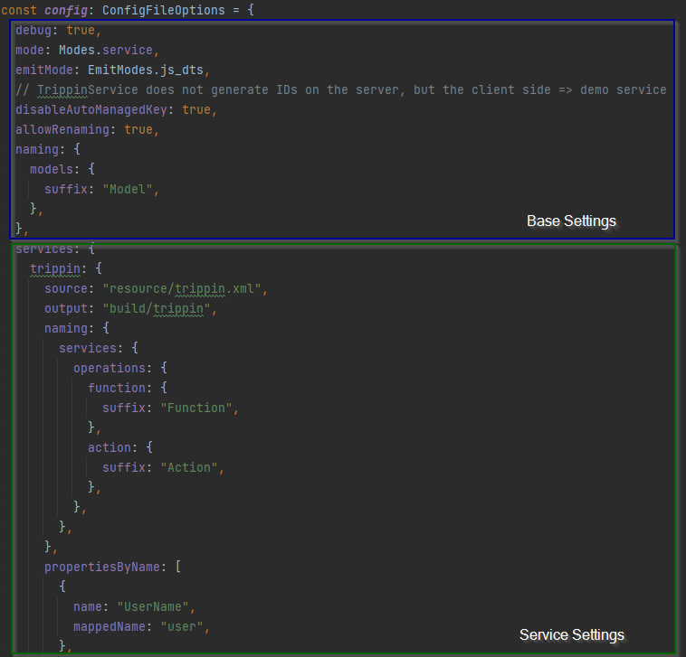

# Configuration

## Basics

### Default Configuration

In the background `odata2ts` has a [defaultConfig](https://github.com/odata2ts/odata2ts/blob/main/packages/odata2ts/src/defaultConfig.ts),
so that you only need to provide those settings which diverge from that.

<p>
  <details>
    <summary>Default Configuration</summary>

```ts
import { ConfigFileOptions, EmitModes, Modes, NamingStrategies } from "@odata2ts/odata2ts";

const defaultConfig = {
  mode: Modes.all,
  emitMode: EmitModes.js_dts,
  debug: false,
  prettier: false,
  tsconfig: "tsconfig.json",
  converters: [],
  skipEditableModels: false,
  skipIdModels: false,
  skipOperations: false,
  disableAutoManagedKey: false,
  allowRenaming: false,
  naming: {
    models: {
      namingStrategy: NamingStrategies.PASCAL_CASE,
      propNamingStrategy: NamingStrategies.CAMEL_CASE,
      editableModels: {
        prefix: "Editable",
        suffix: "",
        applyModelNaming: true,
      },
      idModels: {
        prefix: "",
        suffix: "Id",
        applyModelNaming: true,
      },
      operationParamModels: {
        prefix: "",
        suffix: "Params",
        applyModelNaming: true,
      },
      fileName: {
        namingStrategy: NamingStrategies.PASCAL_CASE,
        prefix: "",
        suffix: "Model",
      },
    },
    queryObjects: {
      namingStrategy: NamingStrategies.PASCAL_CASE,
      propNamingStrategy: NamingStrategies.CAMEL_CASE,
      prefix: "Q",
      suffix: "",
      idFunctions: {
        prefix: "",
        suffix: "Id",
      },
      fileName: {
        namingStrategy: NamingStrategies.PASCAL_CASE,
        prefix: "Q",
        suffix: "",
      },
    },
    services: {
      prefix: "",
      suffix: "Service",
      namingStrategy: NamingStrategies.PASCAL_CASE,
      main: {
        applyServiceNaming: true,
      },
      collection: {
        prefix: "",
        suffix: "Collection",
        applyServiceNaming: true,
      },
      serviceResolverFunction: {
        namingStrategy: NamingStrategies.CAMEL_CASE,
        prefix: "create",
        suffix: "serviceResolver",
      },
      operations: {
        namingStrategy: NamingStrategies.CAMEL_CASE,
      },
      relatedServiceGetter: {
        namingStrategy: NamingStrategies.CAMEL_CASE,
        prefix: "navTo",
        suffix: "",
      },
      privateProps: {
        namingStrategy: NamingStrategies.CAMEL_CASE,
        prefix: "_",
        suffix: "",
      },
      publicProps: {
        namingStrategy: NamingStrategies.PASCAL_CASE,
      },
    },
  },
  propertiesByName: [],
  // entitiesByName: [],
}
```

  </details>
</p>

### Configuration Hierarchy

`odata2ts` exposes different configuration possibilities. Here are all of them and the order in which they are applied:

- **default config**: sensible defaults provided by `odata2ts`
- **base settings**: basic settings which apply to all configured services
- **service settings**: settings for one specific service, `source` and `output` must be specified
- **CLI options**: options provided from command line

The base settings are also some kind of default settings as they have an effect on the generation process
of all configured odata services. Base settings are applied on top of the default config.

All settings starting from the `services` attribute are only valid for a specific service and only applied
for its generation run. Service specific settings may override any default or base setting and allow
for reconfiguring entities and properties.

<p>
  <details>
    <summary>Some visual aid: A picture can say more than a thousand words...</summary>



  </details>
</p>

Options specified on the command line always win over other configuration possibilities.
Most base settings are available as CLI options.
Options `source` and `output` are required unless the config file is also used
containing appropriate service definitions.

:::tip

Consider using the config file for all your configurations
instead of specifying some settings via the command line.

:::

## Base Settings

Here is the list of all **base settings** of the config file. By and large this matches the [CLI options](#cli-options).

| Base Setting          | Type                         | Default Value     | Description                                                                                                                                                                                     |
| --------------------- | ---------------------------- | ----------------- | ----------------------------------------------------------------------------------------------------------------------------------------------------------------------------------------------- |
| mode                  | `Modes`                      | `"all"`           | Allowed are: all, models, qobjects, service. See [generation modes](#generation-modes)                                                                                                          |
| emitMode              | `EmitModes`                  | `"js_dts"`        | Specify what to emit. ALlowed values: ts, js, dts, js_dts. See [emit modes](#emit-modes)                                                                                                        |
| prettier              | `boolean`                    | `false`           | Use prettier to pretty print the TS result files; only applies when emitMode = ts. See [emitting TypeScript](#emitting-typescript)                                                              |
| tsconfig              | `string`                     | `"tsconfig.json"` | When compiling TS to JS, the compilerOptions of the specified file are used; only takes effect, when emitMode != ts. See [emitting JS](#emitting-compiled-js--dts)                              |
| allowRenaming         | `boolean`                    | `false`           | Allow renaming of model entities and their props by applying naming strategies like camelCase or PascalCase. See [renaming properties](#renaming-properties)                                    |
| disableAutoManagedKey | `boolean`                    | `false`           | odata2ts will automatically decide if a key prop is managed on the server side and therefore not editable; here you can turn off this automatism. See [managed properties](#managed-properties) |
| debug                 | `boolean`                    | `false`           | Add debug information                                                                                                                                                                           |
| serviceName           | `string`                     |                   | Overwrites the service name found in OData metadata. But only makes sense on this level when `source` & `output` are specified via CLI options.                                                 |
| skipEditableModels    | `boolean`                    | `false`           | Don't generate separate models for manipulating actions (create, update, patch). See [fine-tuning artefact generation](#fine-tuning-artefact-generation)                                        |
| skipIdModels          | `boolean`                    | `false`           | Don't generate separate models & q-objects for entity ids. See [fine-tuning artefact generation](#fine-tuning-artefact-generation)                                                              |
| skipOperations        | `boolean`                    | `false`           | Don't generate separate models & q-objects for operations (function or action). See [fine-tuning artefact generation](#fine-tuning-artefact-generation)                                         |
| converters            | `Array<TypeConverterConfig>` | `[]`              | Provide list of installed converters to use. See [converter documentation](./converters)                                                                                                        |
| naming                | `OverridableNamingOptions`   | see defaultConfig | Configure naming aspects of the generated artefacts. See [configuring naming schemes](#configuring-naming-schemes)                                                                              |

## Service Settings

There's one more option on the root level of the config file called `services`.
It represents the entry point into the **service settings**, which are by nature specific for a single odata service.
The `services` option is an object, where each key is the internal name of the service
and the value is the configuration (class `ServiceGenerationOptions`).

These service settings contain **all base settings**, options `source` and `output` (cf. CLI options),
as well as options to reconfigure entities and properties:

| Service Setting  | Type                               | Default Value | Description                                                                                                                                      |
| ---------------- | ---------------------------------- | ------------- | ------------------------------------------------------------------------------------------------------------------------------------------------ |
| source           | `string`                           | ---           | Specifies the path to the metadata source file (EDMX). See [setup-and-usage](setup-and-usage#configuration)                                      |
| output           | `string`                           | ---           | Specifies the output directory. This folder gets cleaned and overwritten on generation. See [setup-and-usage](setup-and-usage#configuration)     |
| serviceName      | `string`                           |               | Overwrites the service name found in OData metadata & controls the main service name. Same as the base setting but on this level it makes sense. |
| entitiesByName   | `Array<EntityGenerationOptions>`   | `[]`          | Match entities by their name and configure them. See [generation modes](#generation-modes)                                                       |
| propertiesByName | `Array<PropertyGenerationOptions>` | `[]`          | Match properties by their name and configure them. See [configuration by property](#configuration-by-property)                                   |

## CLI Options

Here is the list of all options available for the command line.
As you can see, this largely matches the **base settings**:

- additionally, `source` and `output` options are available (cf. [service settings](#service-settings))
- options `skipXXX`, `converters` and `naming` are not available though

| CLI Option                            | Default Value     | Description                                                                                                                                                                                     |
| ------------------------------------- | ----------------- | ----------------------------------------------------------------------------------------------------------------------------------------------------------------------------------------------- |
| `--source`<br/>`-s`                   |                   | Specifies the path to the metadata source file (EDMX). See [setup-and-usage](setup-and-usage#configuration)                                                                                     |
| `--output`<br/>`-o`                   |                   | Specifies the output directory. This folder gets cleaned and overwritten on generation. See [setup-and-usage](setup-and-usage#configuration)                                                    |
| `--service-name`<br/>`-name`          |                   | Overwrites the service name found in OData metadata => controls name of main odata service                                                                                                      |
| `--mode`<br/>`-m`                     | `"all"`           | Allowed are: all, models, qobjects, service. See [generation modes](#generation-modes)                                                                                                          |
| `--emit-mode`<br/>`-e`                | `"js_dts"`        | Specify what to emit. ALlowed values: ts, js, dts, js_dts. See [emit modes](#emit-modes)                                                                                                        |
| `--prettier`<br/>`-p`                 | `false`           | Use prettier to pretty print the TS result files; only applies when emitMode = ts. See [emitting TypeScript](#emitting-typescript)                                                              |
| `--tsconfig`<br/>`-t`                 | `"tsconfig.json"` | When compiling TS to JS, the compilerOptions of the specified file are used; only takes effect, when emitMode != ts. See [emitting JS](#emitting-compiled-js--dts)                              |
| `--allow-renaming`<br/>`-r`           | `false`           | Allow renaming of model entities and their props by applying naming strategies like camelCase or PascalCase. See [renaming properties](#renaming-properties)                                    |
| `--disable-auto-managed-key`<br/>`-n` | `false`           | odata2ts will automatically decide if a key prop is managed on the server side and therefore not editable; here you can turn off this automatism. See [managed properties](#managed-properties) |
| `--debug`<br/>`-d`                    | `false`           | Add debug information                                                                                                                                                                           |

## Generation Modes

`odata2ts` is able to produce three different kinds of artefacts:

- `models`: tailor-made TypeScript types for entities, complex types, entity Ids and what not
- `qobjects`: powerful q-objects to leverage the type-safe and fluent query builder
- `service`: full-fledged, domain-savvy OData service capable of type-safe queries, CRUD operations and more

Each artefact type depends on the existence of the former artefact type.
So you can either generate 1) only models, 2) q-objects and models or 3) services, q-objects and models.

You control this aspect of the generation process with the `mode` setting,
which has an enum representation in the config file (`import { Modes } from "@odata2ts/odata2ts"`).

### Fine Tuning Artefact Generation

If you're only interested in `models` or `qobjects`, you might want to skip the generation of
certain artefacts. The following options are available as base-settings:

- skipEditableModels:
  - don't create entity representations needed for create, update and patch operations
- skipIdModels:
  - don't create types representing the ID of each entity type
  - don't create q-id functions, helpful for formatting and parsing entity paths
- skipOperations:
  - don't create types representing function or action parameters
  - don't create q-functions or q-actions which help to handle those operation calls

## Emit Modes

`odata2ts` supports generating JS / dts or TypeScript files. You control this with the `emitMode` option,
which has an enum representation in the config file (`import { EmitModes } from "@odata2ts/odata2ts"`).

By default, JS & dts files are emitted.

### Emitting Compiled JS / dts

Since the generation process only needs to run when your OData service changes (and therewith
its metadata), it makes sense to compile the generated stuff to JS / dts at that moment.
This unburdens your TS compiler when developing your app, as it is not required to compile
the generated code.

By default, `odata2ts` tries to use the `tsconfig.json` at root level for compilation.
You can specify the path to your TS config file via the option `tsconfig`.

You can also configure to produce only JS or only DTS files, whatever that use case may be.

### Emitting TypeScript

When setting the emitMode to TypeScript, you will need to include the output folder for TypeScript.

The easiest route would be to point the output directory to something like `src/generated/trippin`,
assuming that `src` is included in your TS config.

However, a cleaner approach would be an own directory like `gen*src/trippin` and the inclusion
of the `gen-src` folder in your `tsconfig.json`.

`odata2ts` allows to prettify the generated TS files via [prettier](https://prettier.io/).
When installed and configured, you just set the option `prettier` to `true`.

## Managed Properties

Some properties are managed by the server, most notably the ID field:
The server is responsible for generating a unique identifier for each new entity.
Other use cases would be fields like `createdAt` or `modifiedBy` which are
automatically handled by the server or database.

In all of these cases, the client is not allowed to directly update those managed fields.
This fact needs to be reflected in the editable model versions, which are used for create,
update, and patch actions: All managed fields need to be filtered out.

### Automatism

`odata2ts` employs the following automatism:
Single key fields (the key of the entity is composed of one single field), like ID, are marked as `managed`,
while each field of a complex key (the key of the entity is composed of multiple fields) is regarded as `unmanaged`.

If you want to turn off that automatism, use the option `disableAutoManagedKey`.

### Configuration by Property

You can and maybe have to configure properties manually to mark them as managed.

You do so by using the setting `propertiesByName` which expects an array of objects.
Each object must have a `name` property which matches the attribute name as it is stated
in the EDMX of the OData service.

The `name` property can also be a regular expression
which matches the whole name (internally we add "^" to the beginning and "$" to the end of the expression).

```ts
const config = {
  services: {
    myService: {
      propertiesByName: [
        {
          name: /id/i, // uses case insensitive regular expression to find "ID", "id", "Id", ..
          managed: true,
        },
        // use a list of fields
        ...["createdAt", "createdBy", "modifiedAt", "modifiedBy"].map((prop) => ({ name: prop, managed: true }))
      ]
    }
  }
}
```

## Naming

The topic of naming has multiple dimensions:

On the one hand there are naming schemes. Since `odata2ts` generates multiple artefacts out of a
single entity or complex type, naming schemes are required, to discern, for example, a `Person` (model)
from its magical counter-part `QPerson` (q-object). These naming schemes permeate all aspects of the
generated artefacts and are configurable.

On the other hand exists the topic of renaming entities and props. The first question should be: Is this a good
idea? Usually it's a good thing to have frontend and backend aligned on entity and property names (there's some
middle ground however, see "Naming Strategies").
It's also important to realize that when you rename properties, you typically need to have a way to make this renaming
work for both situations: retrieving data and submitting data. By default, `odata2ts` doesn't tamper with the data
at all.

### Naming Strategies

We employ one general concept labelled "naming strategy" and mean by that a certain way to format
a given string regarding its individual parts. The following naming strategies are supported:

- pascal case: "foo bar" => "FooBar"
- camel case: "foo bar" => "fooBar"
- capital case: "foo bar" => "FOO_BAR"
- snake case: "foo BAR" => "foo_bar"

We rely on the [change-case library](https://www.npmjs.com/package/change-case) here.

Naming strategies guarantee consistency without sacrificing semantics, since the original term lives on.
See the `default config` for example usages.

### Renaming Properties

When you generate the full-fledged client and rely on its services for retrieving and submitting
data, then you're good to go.

When generating q-objects, you are able to perform name mappings with the help of them.
See the chapter about conversion or take a look into the service implementations.

Otherwise, you should know what you're doing when renaming properties.

You allow `odata2ts` renaming properties via the base setting `allowRenaming` (false by default).
This will then apply the configured naming strategies for entity and property names.

You can configure properties manually and thereby rename them. Renaming properties this way is
independent of the `allowRenaming` setting.

You do so by using the setting `propertiesByName` which expects an array of objects.
Each object must have a `name` property which matches the attribute name as it is stated
in the EDMX of the OData service. You specify the new name via the `mappedName` property.

```ts
const config = {
  services: {
    myService: {
      propertiesByName: [
        {
          name: "UserName",
          mappedName: "user",
        }
      ]
    }
  }
}
```

### Configuring Naming Schemes

In general, most naming schemes consist of the following settings:

- prefix
- suffix
- namingStrategy

As best practice, always override `prefix` **and** `suffix`, when you want to set one or the other.

Here is an example showing the default naming options for models:

```ts
const namingConfig = {
  naming: {
    models: {
      namingStrategy: NamingStrategies.PASCAL_CASE,
      propNamingStrategy: NamingStrategies.CAMEL_CASE,
      editableModels: {
        prefix: "Editable",
        suffix: "",
        applyModelNaming: true,
      },
      idModels: {
        prefix: "",
        suffix: "Id",
        applyModelNaming: true,
      },
      operationParamModels: {
        prefix: "",
        suffix: "Params",
        applyModelNaming: true,
      },
      fileName: {
        namingStrategy: NamingStrategies.PASCAL_CASE,
        prefix: "",
        suffix: "Model",
      },
    }
  }
}
```

If the special property `applyModelNaming` is `true`, then prefix and suffix of the parent property
are added as well.

A common convention is to add "I" in front of interfaces, which would be as easy as this:

```ts
const namingConfig = {
  naming: {
    models: {
      prefix: "I",
      suffix: ""
    }
  }
}
```

Now all models would be prefixed in this way, e.g. "IPerson", "IEditablePerson", "IPersonId".
