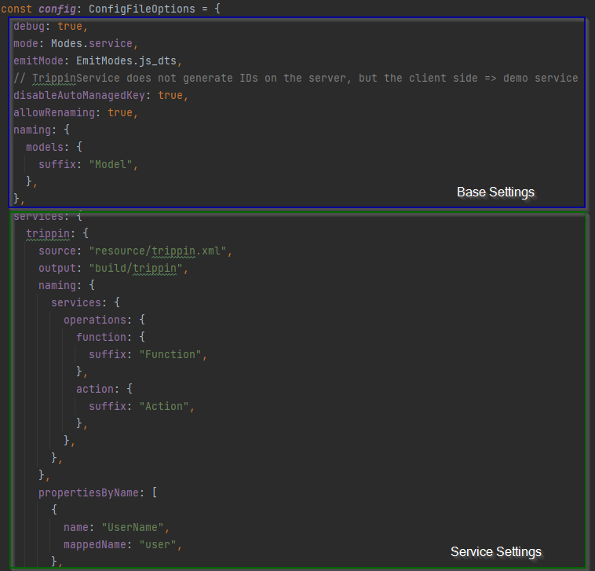

# Configuration

## Default Config

In the background `odata2ts` has a [defaultConfig](https://github.com/odata2ts/odata2ts/blob/main/packages/odata2ts/src/defaultConfig.ts),
so that you only need to provide those settings which diverge from that.

<p>
  <details>
    <summary>Default Configuration</summary>

```ts
import { ConfigFileOptions, EmitModes, Modes, NamingStrategies } from "@odata2ts/odata2ts";

const defaultConfig = {
  mode: Modes.all,
  emitMode: EmitModes.js_dts,
  debug: false,
  prettier: false,
  tsconfig: "tsconfig.json",
  converters: [],
  skipEditableModels: false,
  skipIdModels: false,
  skipOperations: false,
  disableAutoManagedKey: false,
  allowRenaming: false,
  naming: {
    models: {
      namingStrategy: NamingStrategies.PASCAL_CASE,
      propNamingStrategy: NamingStrategies.CAMEL_CASE,
      editableModels: {
        prefix: "Editable",
        suffix: "",
        applyModelNaming: true,
      },
      idModels: {
        prefix: "",
        suffix: "Id",
        applyModelNaming: true,
      },
      operationParamModels: {
        prefix: "",
        suffix: "Params",
        applyModelNaming: true,
      },
      fileName: {
        namingStrategy: NamingStrategies.PASCAL_CASE,
        prefix: "",
        suffix: "Model",
      },
    },
    queryObjects: {
      namingStrategy: NamingStrategies.PASCAL_CASE,
      propNamingStrategy: NamingStrategies.CAMEL_CASE,
      prefix: "Q",
      suffix: "",
      idFunctions: {
        prefix: "",
        suffix: "Id",
      },
      fileName: {
        namingStrategy: NamingStrategies.PASCAL_CASE,
        prefix: "Q",
        suffix: "",
      },
    },
    services: {
      prefix: "",
      suffix: "Service",
      namingStrategy: NamingStrategies.PASCAL_CASE,
      main: {
        applyServiceNaming: true,
      },
      collection: {
        prefix: "",
        suffix: "Collection",
        applyServiceNaming: true,
      },
      serviceResolverFunction: {
        namingStrategy: NamingStrategies.CAMEL_CASE,
        prefix: "create",
        suffix: "serviceResolver",
      },
      operations: {
        namingStrategy: NamingStrategies.CAMEL_CASE,
      },
      relatedServiceGetter: {
        namingStrategy: NamingStrategies.CAMEL_CASE,
        prefix: "navTo",
        suffix: "",
      },
      privateProps: {
        namingStrategy: NamingStrategies.CAMEL_CASE,
        prefix: "_",
        suffix: "",
      },
      publicProps: {
        namingStrategy: NamingStrategies.PASCAL_CASE,
      },
    },
  },
  propertiesByName: [],
  // entitiesByName: [],
}
```

  </details>
</p>

## Base Settings

All CLI options (except `source` and `output`) and all settings within the config file which don't belong to the `services` attribute
are **base settings**.

The base settings are also some kind of default settings as they have an effect on the generation process
of all configured odata services. Base settings are applied on top of the default config.

Here we can also see the limitations of the CLI options: They are the base settings.
More advanced stuff requires the config file.

## Service Settings

All settings starting from the `services` attribute are only valid for a specific service and only applied
for its generation run. Service specific settings are applied on top of the base settings.



## CLI Options

Options specified on the command line always win over other configuration possibilities.

Options `source` and `output` are required unless the config file is used
containing appropriate service definitions.

Consider using the config file instead of specifying any settings via the command line.

| Option                     | Shorthand | Required | Default       | Description                                                                                                                                      |
| -------------------------- | --------- | :------: | ------------- | ------------------------------------------------------------------------------------------------------------------------------------------------ |
| --source                   | -s        |   (x)    |               | Specifies the source file, i.e. metadata description                                                                                             |
| --output                   | -o        |   (x)    |               | Specifies the output directory                                                                                                                   |
| --mode                     | -m        |          | all           | Allowed are: all, models, qobjects, service                                                                                                      |
| --emit-mode                | -e        |          | js_dts        | Specify what to emit. ALlowed values: ts, js, dts, js_dts                                                                                        |
| --prettier                 | -p        |          | false         | Use prettier to pretty print the TS result files; only applies when emitMode = ts                                                                |
| --tsconfig                 | -t        |          | tsconfig.json | When compiling TS to JS, the compilerOptions of the specified file are used; only takes effect, when emitMode != ts                              |
| --allow-renaming           | -r        |          | false         | Allow renaming of model entities and their props by applying naming strategies like camelCase or PascalCase                                      |
| --disable-auto-managed-key | -n        |          | false         | odata2ts will automatically decide if a key prop is managed on the server side and therefore not editable; here you can turn off this automatism |
| --debug                    | -d        |          | false         | Add debug information                                                                                                                            |
| --service-name             | -name     |          |               | Overwrites the service name found in OData metadata => controls name of main odata service                                                       |
