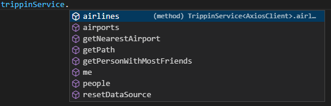
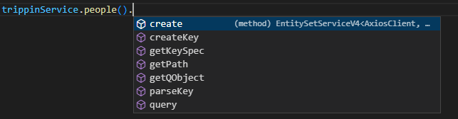
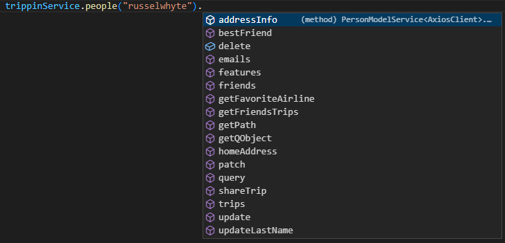
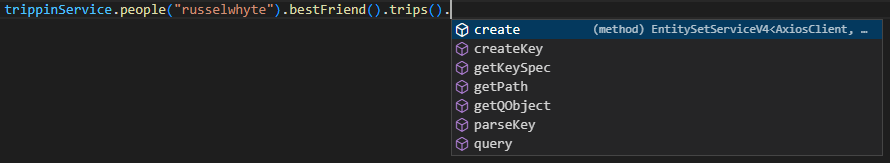
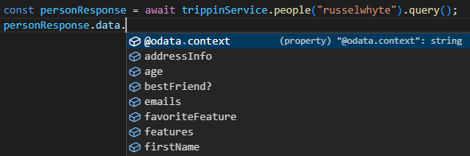
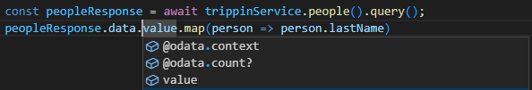

# The Main Service

So `odata2ts` generated the main service class, and you created the instance:

```ts
// the generated main service
import { TrippinService } from "../build/trippin/TrippinService";

//... see complete initialization in chapter Overview & Setup

// initialize the service
const trippinService = new TrippinService(httpClient, baseUrl);
```

Equipped with this **main service** you have a single entry point into your OData service
and can now explore the service from the client side with the power of TypeScript.



You can already see unbound [operations](#custom-operations) (`getNearestAirport` or `resetDataSource`)
as well as the exposed entity sets (`people`, `airports`, etc.) which are used for [querying](#querying)
and the other [CRUD operations](#crud-operations).

But first we need to discuss how to navigate the OData service, because OData establishes a navigation
concept that goes beyond your typical REST service.

::: note

The real entity set and operation names of the TrippinService are in Pascal case
(`People`, `GetNearestAirport`, ...). Setting `allowRenaming` to `true` will
convert those names to camel case, so that this feels more "natural" from a JS / TS standpoint.
See [renaming](../generator/configuration#naming) for all the options. In all examples it is
assumed that this setting would have been active.

:::

## Navigation

OData exposes and advertises [entry points](#entry-points), most often **entity sets**
(e.g. `/People`). We can traverse to a specific entity of that collection by its key(s)
(e.g. `/People('russelwhyte')`) and use its [navigation properties](#navigation-properties)
to traverse ever deeper into the service (e.g. `/People('russelwhyte')/BestFriend/Trips`).
There is no defined end to this kind of navigation.

With `odata2ts` you call a function for each step of your way, which creates the appropriate service
tailored to the entity or collection at hand. Conveniently, we thereby also build up the URL sequentially.

But let's start at the beginning: The main service lists all entity sets, so you call
the appropriate function, e.g. `trippinService.people()`.



To navigate to a specific entity, you specify it's key when calling the appropriate function:
`trippinService.people({userName: "russelwhyte"})`. This is the general form which must be used when handling
entities with composite keys. However, you can use the short form for entities with single keys:
`trippinService.people("russelwhyte")`.



And ever deeper via **navigation properties**:


### `getPath()`

You'll find the helper method `getPath()` in most services. It will give you the current URL created by
your traversal through the service.

### `getQObject()`

Any entity related service offers the helper method `getQObject()` to retrieve the **query object** for the
entity type at hand. The query object bundles all the functionality related to that particular entity type.

## Querying

OData has powerful querying capabilities and this is where `odata2ts` might help you the most:
Building even complex OData queries with ease. But let's first start with the basics, before we get
to the query builder.

### `query()`

In the most simplistic case - which might be called "read" - you just call the `query()` function
on any entity or entity collection.

Calling `query()` will eventually execute the HTTP request to the server and so it returns a `Promise`:

```ts
// get the entire entity collection (in async-await style)
const peopleResponse = await trippinService.people().query();
// peopleResponse: HttpResponseModel<ODataCollectionResponseV4<PersonModel>>

// get a particular entity in its entirety (classical promise based style)
trippinService.people("russelwhyte").query().then((personResponse) => {
  // personResponse: HttpResponseModel<ODataModelResponseV4<PersonModel>>
});

// you can also force a sub-type by supplying it to the query via generics
const specialPersonResponse = await trippinService.people("russelwhyte").query<SpecialPerson>();
// specialPersonResponse: HttpResponseModel<ODataModelResponseV4<SpecialPerson>>
```

When the promise resolves we get an `HttpResponseModel` representing the response from the server.
It contains the response `status`, the response `headers`, and the response body evaluated to JSON,
called `data`.

The structure of the response `data` largely depends on two factors, the OData version and which kind
of type was targeted (EntityType, Collection, etc.). Querying for an entity in a V4 OData service adds
no additional data structures, the model is directly available:



Querying for a collection gives us a structure with the `value` property,
which contains the result array of the given entity type. When using the
`count()` operation of the query builder, then `@odata.count` will give you
the total amount of records (defined as `Edm.Int64`):



See the section about [response structures](#response-structures) for more info.

### Query Builder

Let's take a look at the query builder. To get the builder you provide a **callback function**
as parameter to the `query()` method. The signature of the callback function:

- **first parameter**: fully initialized query builder
- **second parameter** (optional): query object representing the entity type in question
- **returns**: the query builder

```ts
await trippinService.people().query((builder, qPerson) => {
  return builder
    // filter and orderBy operations make use of the query object
    .filter(qPerson.age.gt(65).or(qPerson.age.lt(18)), qPerson.lastName.contains("x"))
    .orderBy(qPerson.lastName.asc(), qPerson.firstName.asc(), qPerson.age.desc())
    // response shaping operations: select and expanding
    // here we just use the keys, but still in a type-safe fashion
    .select("lastName", "firstName", "age")
    .expanding("bestFriend", (bfBuiler) => bfBuiler.select("lastName"))
    .expanding("trips", (tripBuilder, qTrip) => {
      return tripBuilder.orderBy(qTrip.budget.desc())
    })
  }
);
```

From this example you can see that the builder

- offers a fluent API
- makes heavy use of the query objects to provide for type-safe filtering
- also makes use of the bare property names, but still in a type-safe fashion

You get the complete [query builder documentation](../query-builder/querying) in its own chapter.

## CRUD Operations

The acronym "CRUD" describes the basic operations on an entity and has been translated into
HTTP verbs for REST web services (OData being a specialized version of REST):

- **C**reate: `POST`
- **R**ead: `GET`
- **U**pdate:
  - Replacing Update: `PUT`
  - Partial Update: `PATCH`
- **D**elete: `DELETE`

So there are two different update methods: The replacing update (`PUT`) replaces the entire entity with
the stuff that you provide, while the partial update (`PATCH`) only updates those fields that you
provide, leaving the rest of the entity as it was. The OData spec clearly recommends usage of the
partial update and argues with better resiliency.

**Creating** an entity necessarily happens on the collection level,
while **updating** and **deleting** requires the entity in question.

```ts
await trippinService.people().create(model);
await trippinService.people("russelwhyte").update(model);
await trippinService.people("russelwhyte").patch(model);
await trippinService.people("russelwhyte").delete();
```

The **reading** part has already been covered in [querying](#querying).

### Editable Model Versions

Now the model type that is used for create or update (e.g. `EditablePerson`) is not the same one that
you get from a query response (e.g. `Person`). There are multiple reasons for that distinction.

For one, when querying for something like an ID field, you definitely get a value, because from a database
standpoint, it is required. However, when creating a new entity - and the server is responsible for generating
the ID (as it should be) - you cannot specify the ID that is about to be generated. So the whole property
should be left out for create (and update) requests. `odata2ts` allows to configure these
[managed properties](../generator/configuration#managed-properties),
which only affect the editable model version (e.g. `EditablePerson`).

```ts
import { Person, EditablePerson } from "../generated/TrippinModel"

const model: EditablePerson = {...};
await trippinService.people().create(model);
```

The naming in regard to "Editable" is completely configurable:
see [configuring naming schemes](../generator/configuration#configuring-naming-schemes).

:::note

Currently, `odata2ts` does not differentiate models for update and create. This might become relevant
in the future though: See [#140](https://github.com/odata2ts/odata2ts/issues/140)

:::

### Responses

The **Delete** action must respond with `204 (No Content)` on success.

**Update** actions either respond with status code `200` containing the updated entity
in the response body or with status code `204 (No Content)` with no response body at all.

**Create** should respond with HTTP status `201 (Created)` and return the created entity
as response body. If your OData service works this way, then everything is fine from the client side.

However, OData services are also allowed to return `204 (No Content)`
(cf. [OData V4 spec](https://docs.oasis-open.org/odata/odata/v4.01/odata-v4.01-part1-protocol.html#sec_CreateanEntity))
and in this case you don't get any response body. And now you would have the following problem:
What's the generated ID of the entity that I've just created?

The one thing that the create method MUST return is the `Location` header which represents
the edit / read URL of the entity, e.g.:<br />
`Location:  https://services.odata.org/TripPinRESTierService/People('heineritis')`.

Provided with this information you are now tasked with parsing that key out of the URL.
`odata2ts` can help here with one of its helper functions: see [parseKey()](#parsekey).

See the section about [response structures](#response-structures) for more information.

### `createKey()`

The helper method `createKey()` is available on the collection level and allows you to generate
OData conform URL paths for entities.

```ts
// shorthand version
const personUrl = trippinService.people().createKey("russelwhyte");
// personUrl = "People('russelwhyte')"

// complex version
const personUrlComplex = trippinService.people().createKey({ userName: "russelwhyte" });
// personUrlComplex = "People(UserName='russelwhyte')"

// complex version is required for composite keys
const result = myService.translations().createKey({ key: "myKey", language: "en"  });
// result = "Translation(Key='myKey',Language='en')"
```

This functionality is, of course, used internally by `odata2ts` and is only exposed for your
convenience. One use case might be to use this syntax for client side routing.

### `parseKey()`

The helper method `parseKey()` is available on the collection level and is able to parse OData conform
URL paths in order to retrieve the entity keys.

```ts
// parsing the shorthand version
const personKey = trippinService.people().parseKey("People('russelwhyte')");
// personKey = "russelwhyte"

// parsing the complex version
const personKeyComplex = trippinService.people().parseKey("People(UserName='russelwhyte')");
// personKeyComplex = { userName: "russelwhyte" }
```

It's actually irrelevant how the URL starts and if the entity part really fits, hence passing something
like `https://mytest/t('russelwhyte')` as value for the first example would yield the exact same result
`"russelwhyte"`. So it's only important that you pick the right entity type to parse the key with.

## Custom Operations

"Operations" is the general term used to denominate "functions" and "actions".
**Functions** represent custom `GET` requests for the purpose of retrieving data;
ideally, functions are free from side effects.
**Actions** represent custom `POST` requests for the purpose of creating a side effect,
most often manipulation of state.

You find **custom operations** bound to different levels of the service hierarchy:

- unbound: found at the root level of the service, where entity sets reside
- bound to an entity: the first parameter will be the given entity defined by the URL path
- bound to an entity collection
  - this is neither explicitly endorsed nor disallowed by the spec
  - I've only seen this using SAP's RAP framework

```ts
// unbound function
const popReponse = await trippinService.getPersonWithMostFriends();
// popResponse: HttpResponseModel<ODataModelResponseV4<Person>>

// unbound function with parameters
const nearResponse = await trippinService.getNearestAirport({ lat:51.918777, lon: 8.620930 });
// nearResponse: HttpResponseModel<ODataModelResponseV4<Airport>>

// entity bound action
await trippinService.people("russelwhyte").shareTrip({tripId: 1, userName: "russelwhyte"});
```

As with any request, you can supply a [request configuration](#request-configuration) and the topics
of [response structures](#response-structures) and [exception handling](#exception-handling) come
into play.

:::note

For SAP users: RAP is only able to bind operations to entity collections or entity types;
there is no way to create an unbound operation.

:::

### V2: Unbound Functions Only

OData V2 only knows functions on the root level (find the `FunctionImport` element in EDMX),
i.e. **unbound functions**.

This means on a practical level, that any V2 service is limited to custom `GET` requests.
Actually, V2 also allows to change the HTTP method to `POST` (attribute `m:HttpMethod="POST"`)
and this is also supported by `odata2ts` out-of-the-box.
However, even as `POST` request the payload of that request is never the request body,
but always only the URL query parameters. Hence, it cannot really be regarded as a `POST` request.

:::tip

As `GET` request have limitations regarding the payload (URLs have browser-dependent limit on their length),
`POST` requests are often necessary. One work-around I've heard of: defining a custom entity
and semantically misusing the `create` request. I wouldn't call this a recommendation of any sorts,
but people have taken this approach.

:::

## Request Configuration

Whatever the request - CRUD or custom - you always have the option to pass a request configuration as last
parameter. At the utmost minimum, you should be able to set custom headers for the request.

However, the type of the request configuration is entirely dependent on the chosen [HTTP client](./http-client/).
Minimal example, based on the Axios client:

```ts
trippinService.people().create(model, { headers: { "myCustomHeader": "myCustomHeaderValue" } });
```

## Response Structures

`odata2ts` enforces a conventionalized response structure which starts with the `HttpResponseModel`.
This conventionalized structure is used for any OData operation - CRUD or custom. It contains:

- the response `status`: numeric value
- the response `statusText`: something like "OK" or "No Content"
- the response `headers`: which is a flat map, i.e. `Record<string,string>`
- the response `data`: this the response body evaluated to JSON

### OData Response Models

The structure of `data` largely depends on two factors:

- which OData version is used: V2 or V4?
- the return type in question: is it a collection type or entity type or value type?

Let's work with generics here, so whatever the type in question, we call it `T`:

| Return Type           | OData Version | Response Structure                               |
| --------------------- | ------------- | ------------------------------------------------ |
| Collection            | V4            | `{ "@odata.count"?: number; value: Array<T> }`   |
| Entity / Complex Type | V4            | `T`                                              |
| Value Type            | V4            | `{ value: T }`                                   |
| Collection            | V2            | `{ d: { __count?: string; results: Array<T> } }` |
| Entity / Complex Type | V2            | `{ d: T }`                                       |
| Value Type            | V2            | `{ d: { [propName: string]: T } }`               |

As you can see, V4 is pretty straightforward: The `data` property will be filled with the entity or
complex type model, or we get an additional object containing the `value` property.

In V2 things are more complicated: Each kind of request wraps the response in an extra object with the
property `d`. Collections are wrapped again, like in V4, but with the property `results` (this is not
always the case, see [extra results wrapping](#v2-extra-results-mapping)).

Value Types (e.g. selecting a primitive property of an entity) are really special in V2. First you
have the standard wrapping with `d` and then you use the name of the property in question as the key
of this single valued map. So requesting `GET Trippin/People('russelwhyte')/LastName` will result in
`{ d: {LastName: "Whyte"} }`.

### V2: Extra Results Mapping

Some V2 services will return expanded collections with an extra `results` wrapping. To give you an
example for that, imagine we're querying for one person and expand its "trips" property. The result
would then look like:

```json
{
  "d": {
    "UserName": "russelwhyte",
    "Trips": {  // here comes the extra wrapping; Trips should be the array
      "results": [...]
    }
  }
}
```

When comparing to the [V2 spec, chapter 9](https://www.odata.org/documentation/odata-version-2-0/json-format/),
this seems to be wrong: Trips should already list the array of entities without this extra "results" wrapping.
However, the spec itself is quite vague in this regard.

When using the main service, the generated types won't contain this extra wrapping and
`odata2ts` will remove this extra wrapping at runtime. You don't have to configure anything for that,
it just works out-of-the-box. See [#125](https://github.com/odata2ts/odata2ts/issues/125).

When only generating model types, this runtime work-around cannot work. Instead, you want the types
to contain the extra wrapping. In this scenario, you specify an extra configuration
`v2ModelsWithExtraResultsWrapping` and set it to `true`.
See [#153](https://github.com/odata2ts/odata2ts/issues/153).

## Exception Handling

Any request that succeeds with a response but has a status code outside the `2xx` range (200 - 299),
will cause an exception to be thrown. These are the typical exceptions (not found, validation failures,
server errors) one has in mind when communicating with a REST server.

The actual failure message from the server is contained within the response body. Because OData defines
the response body structure, `odata2ts` already knows how to retrieve the failure message. You can also
provide your own message retrieval logic when initializing the HTTP client.

In these cases, the thrown exception will carry the following information:

- `message` (`string`): some static message + the actual failure message from the server
- `status` (`number`): HTTP response status
- `headers` (`Record<string, string>`): HTTP response headers
- `cause` (`Error`): new error object; its message only contains the actual failure message from the server
- `name` (`string`): the name of this error class, e.g. "FetchClientError" or "AxiosClientError"

Of course, other types of failures can occur as well when trying to execute a request:
Maybe invoking some method of the given HTTP client fails, maybe the request fails,
maybe the connection is lost, maybe the JSON parsing of the response body fails, etc.

In any case, each exception is translated to one specific error type. And while this error type is
dependent on the chosen HTTP client implementation, it should extend `Error` and
implement the `ODataClientError` interface. So we get the following information:

- `message`: some static message + message from the thrown error
- `status`: if the request succeeded, the HTTP response status, otherwise `undefined`
- `headers`: if the request succeeded, the HTTP response status, otherwise `undefined`
- `cause`: the thrown error, if any
- `name`: the name of this error class, e.g. "FetchClientError" or "AxiosClientError"

Let's see this in action:

```ts
// async-await style
try {
  await trippinService.people().query();
} catch(error) { // this error cannot be typed
  // let's cast this error to one we can work with
  const theError = error as ODataClientError;
  // as example, handle validation failures
  if (theError.status === 400) {
    // ...
  }
}

// classical promise style
trippinService.people().query()
  .then((response) => {
    // ...
  })
  .catch((error: ODataClientError) => {
    if (error.status === 400) {
      //...
    }
  });
```

## OData Basics

### Entry Points

OData services expose **entity sets** and - since V4 - **singletons** as entry points into the service.
Each OData service must list these entry points when its root URL is called
(e.g. https://services.odata.org/TripPinRESTierService/).

This information is, of course, also present in the meta description of the service.
In EDMX you will find the `EntityContainer` element:

```xml
<EntityContainer Name="Container">
  <EntitySet Name="People" EntityType="Trippin.Person">...</EntitySet>
  <Singleton Name="Me" Type="Trippin.Person">...</Singleton>
  ...
</EntityContainer>
```

The **entity set** represents a collection of entities, while the **singleton** represents one entity.
Any semantics are determined by the server, e.g. that `/Me` refers to the current user.
Both concepts really only exist as means of defining entry points into the OData service.

### Navigation Properties

An entity may encompass properties which represent another entity or entity collection.

```xml
<EntityType Name="Person">
  <!-- ...  -->
  <NavigationProperty Name="BestFriend" Type="Trippin.Person" />
  <NavigationProperty Name="Trips" Type="Collection(Trippin.Trip)" />
</EntityType>
```

These relations can be traversed:

```
GET /People('russelwhyte')/Trips
GET /People('russelwhyte')/Trips(0)
GET /People('russelwhyte')/BestFriend
GET /People('russelwhyte')/BestFriend/Trips
```

### `MERGE`

The OData V2 spec already introduced the distinction between a replacing update and a partial update
which updates only those fields that have been specified.
But the OData V2 spec was published before the `PATCH` request was officially supported by the HTTP spec
(cf. [Operations Spec](https://www.odata.org/documentation/odata-version-2-0/operations/), chap. 2.6).
So OData V2 defined its very own `MERGE` HTTP request, before adopting `PATCH` from V3 onwards.

And to be sure:

- OData V2 only supports `MERGE`
- OData V3 supports both
- OData V4 only supports `PATCH`

`odata2ts` treats this as implementation detail and only offers the `patch` method for
V4 as well as V2.

:::tip

Custom request methods like `MERGE` are not supported by every HTTP client.
But `MERGE` can always be emulated as `POST` request with the special header `X-Http-Method: MERGE`.

:::
